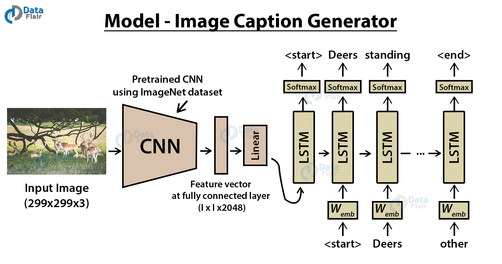
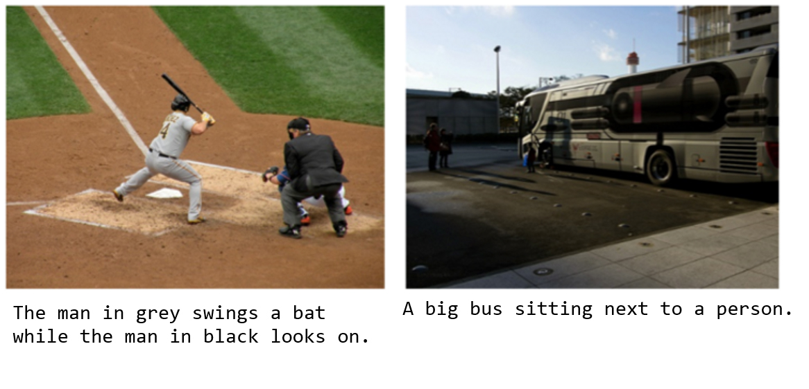
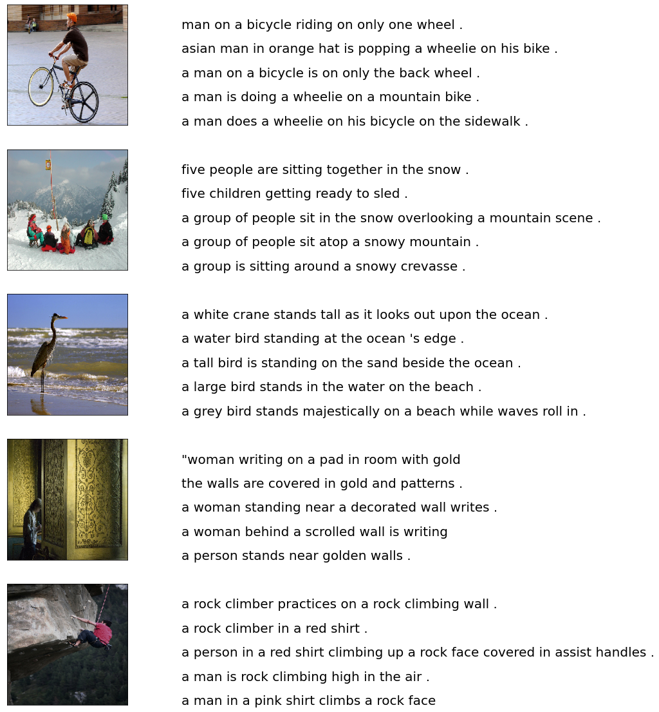
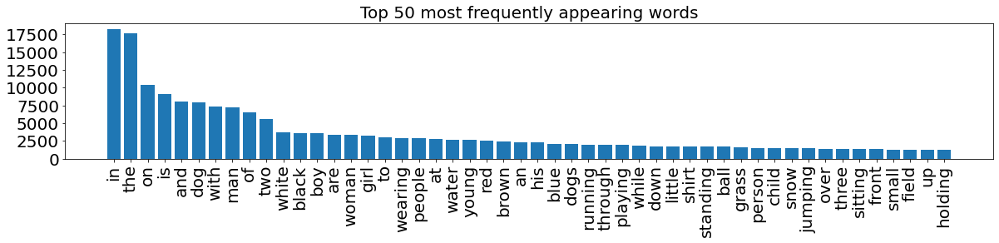
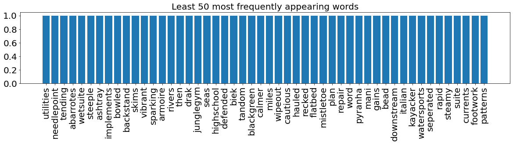
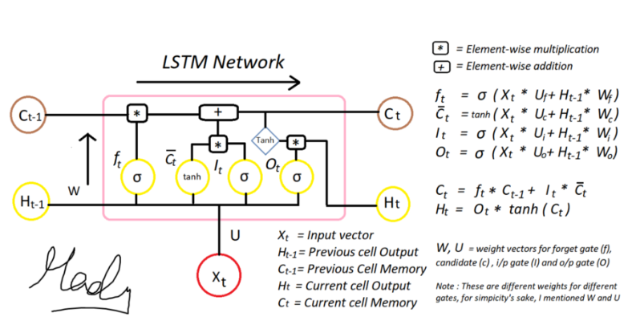
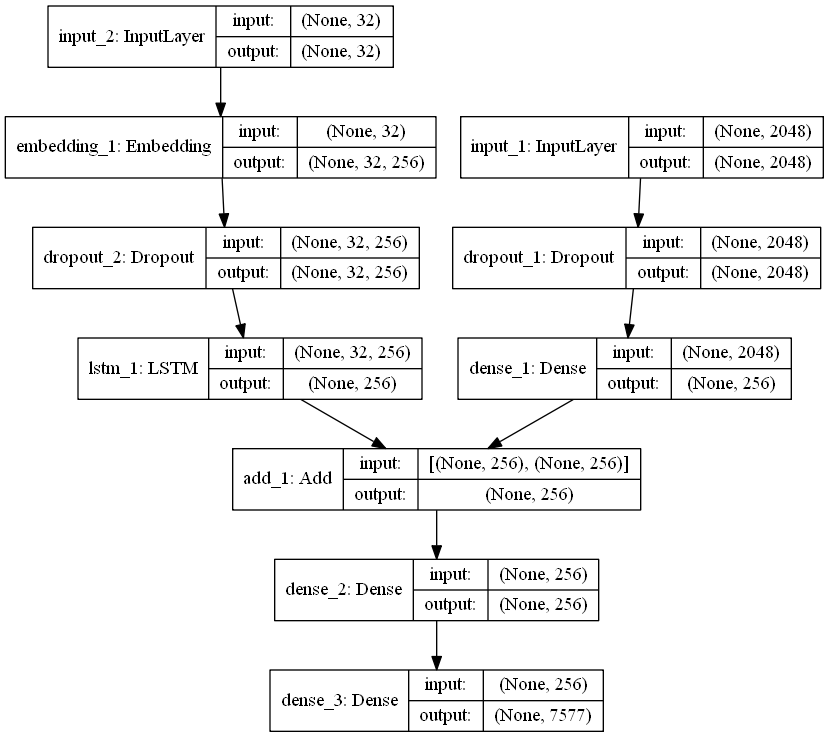
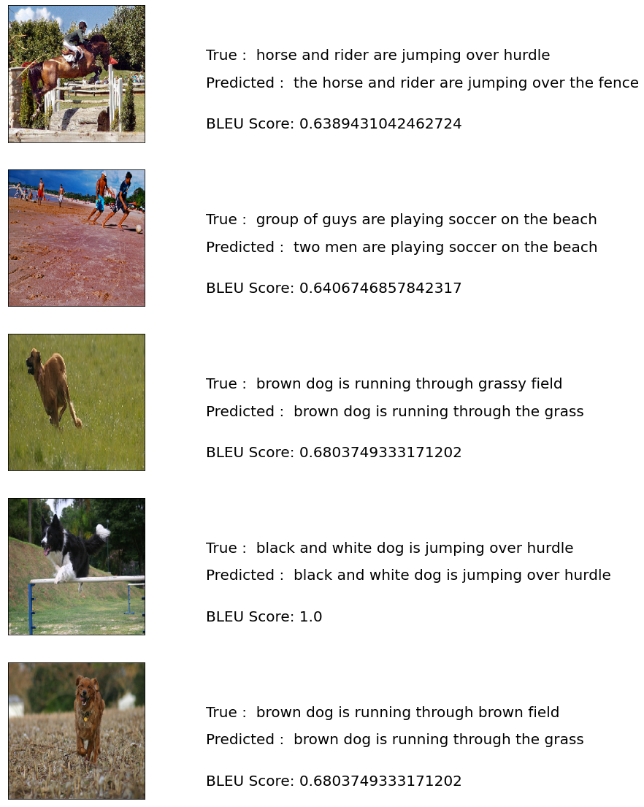
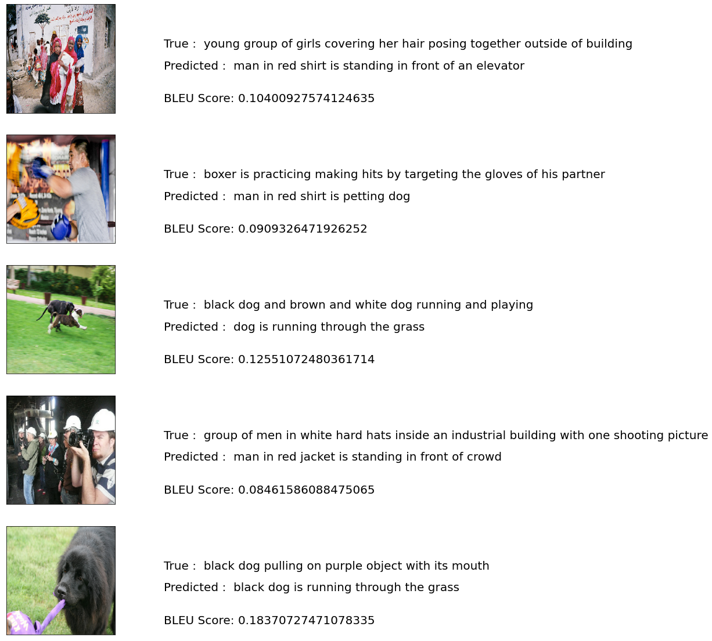

# Image-Caption-Generator

Image caption generator is a task that involves computer vision and natural language processing concepts to recognize the context of an image and describe them in a natural language like English.

## Image Caption Generator with CNN – About the Python based Project
The objective of the project is to understand the concepts of a CNN and LSTM model and build a working model of Image caption generator by implementing CNN with LSTM.

In this Python project, I implemented the caption generator using CNN (Convolutional Neural Networks) and LSTM (Long short term memory). The image features will be extracted from Xception which is a CNN model trained on the imagenet dataset and then we feed the features into the LSTM model which will be responsible for generating the image captions.

## Dataset
[FLICKR_8K](https://www.kaggle.com/adityajn105/flickr8k) This dataset includes around 8000 images along with 5 different captions written by different people for each image. The images are all contained together while caption text file has captions along with the image number appended to it. The zip file is approximately over 1 GB in size.

## Flow of the project
#### a. Cleaning the caption data
#### b. Extracting features from images using pre-trained Xception model
#### c. Merging the captions and images
#### d. Building LSTM model for training
#### e. Predicting on test data
#### f. Evaluating the captions using BLEU scores as the metric

## Steps to follow:
### 1. Cleaning the captions
This is the first step of data pre-processing. The captions contain regular expressions, numbers and other stop words which need to be cleaned before they are fed to the model for further training. The cleaning part involves removing punctuations, single character and numerical values. After cleaning we try to figure out the top 50 and least 50 words in our dataset.

### 2. Extracting features from images
* After dealing with the captions we then go ahead with processing the images. For this we make use of the pre-trained Xception model weights.
* Instead of using this pre-trained model for image classification as it was intended to be used. We just use it for extracting the features from the images. In order to do that we need to get rid of the last output layer from the model. The model then generates 2048 features from taking images of size (229,229,3).

### Building the LSTM Model

LSTM model is been used beacuse it takes into consideration the state of the previous cell's output and the present cell's input for the current output. This is useful while generating the captions for the images.
The step involves building the LSTM model with two or three input layers and one output layer where the captions are generated. The model can be trained with various number of nodes and layers. We start with 256 and try out with 512 and 1024. Various hyperparameters are used to tune the model to generate acceptable captions.

### Predicting test dataset and evaluting using BLEU Scores
After the model is trained, it is tested on test dataset to see how it performs on caption generation for just 5 images. If the captions are acceptable then captions are generated for the whole test data.
These generated captions are compared to the actual captions from the dataset and evaluated using BLEU scores as the evaluation metrics. A score closer to 1 indicates that the predicted and actual captions are very similar. As the scores are calculated for the whole test data, we get a mean value which includes good and not so good captions. Some of the examples can be seen below:
#### Good Caption

#### Bad Caption

## Conclusion
Implementing the model is a time consuming task as it involved lot of testing with different hyperparameters to generate better captions. The model generates good captions for the provided image but it can always be improved.
